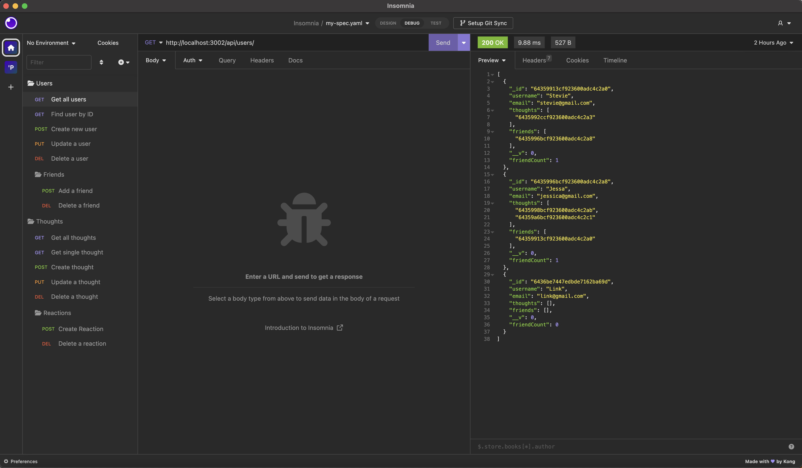

# Mangoes and Mongeese

  ## Table of Contents 
  - [Description](#description)
  - [License](#license)
  - [Installation](#installation)
  - [Usage](#usage)
  - [Contributing](#contributing)
  - [Tests](#test)
  - [Questions](#questions)

  ## Description 
  Mangoes and Mongeese is a social network API built using MongoDB and tested using Insomnia. 

  

  ## Installation
  Clone the code and install Express.js and MongoDB.

  ## Usage
  Run the app in the terminal using `npm run start`
  Use Insomnia, Postman, or any other API client to test the routes

  ## License
  This project uses MIT

  [Click here to view license](https://opensource.org/licenses/MIT)

  

  ## Contributing
  Contact me

  ## Tests
  Insomnia to test endpoints.

  ## Questions
  - Author: Stevie Miller
  - GitHub: [StevieMiller](https://github.com/StevieMiller)
  - Email: stephanie.miller@carlsbadschools.net